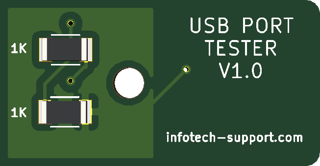

USB Port Tester
===============================
This is Simple USB polarity and data activity tester.

License
-------

 

This project is licensed under the Attribution-NonCommercial-ShareAlike CC BY-NC-SA 4.0 license. The full legal text of the license may be found in the LICENSE.txt file in this repository. For more information about this license, please visit 
the Creative Commons Foundation (https://creativecommons.org/licenses/by-nc-sa/4.0/).

Features
--------

* Small footprint

* Polarity test

* Data activity test

----------
Front:

Back:

----------
	
Basic Usage
-----------

* Green LED ON
			
		USB Port Polarity OK
		
* Red LED ON
		
		USB Port Polarity Reversed
		
* Blue LED ON/FLICKERS
		
		USB Port DATA Port OK

* NO LED ON
		
		USB Port DEAD OR DISCONNECTED